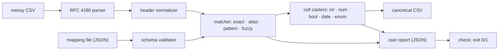

# colcast

[English](README.md) | [中文](README.zh.md) | [日本語](README.ja.md)

[](LICENSE)   [](CONTRIBUTING.md)

**colcast は乱雑な CSV ヘッダーを正規スキーマへマッピングする——宣言的ルールとファジーフォールバック、型付きセル変換、監査可能なレポート。ホスト型インポート SaaS ではなく、ゼロ依存の CLI 兼ライブラリ。**


```bash
# not yet on npm — install from a checkout of this repository
npm install && npm run build && npm pack
npm install -g ./colcast-0.1.0.tgz
```

## なぜ colcast？

B2B プロダクトはどれも顧客の CSV を取り込み、そして顧客ごとに列名は違う：`E-Mail Address`、`SURNAME`、`Licence Count`、`"MRR, USD"`。チームは同じマッピング層を永遠に作り直し続ける——インポート SaaS 企業が存在する理由がまさにこれだ——さもなくばホスト型インポーターを買い、顧客データを第三者へ送ることになる。colcast はその層を小さなローカルツールにしたもの：正規スキーマを JSON マッピングファイルに一度だけ宣言し（名前、エイリアス、正規表現パターン、型、必須フラグ）、4 段階マッチャーが入ってくるヘッダーを順に解決する——完全一致、エイリアス、パターン、そしてタイポ・語順入れ替え・`Qty` 式略語に耐えるファジーフォールバック。続いて各セルはロケール差に寛容なまま宣言された型へ変換され（`€1.234,50`、`(150)`、`Nov 3 2024`、`yes`）、ツールが下した全決定——どの段階が何点で一致したか、どの候補がなぜ落選したか、どのセルがどの行でなぜ失敗したか——が CI のゲートに使える JSON 変換レポートに残る。決定的、オフライン、ランタイム依存ゼロ。

|  | colcast | Flatfile | OneSchema | csv-parse |
|---|---|---|---|---|
| 実行場所 | 自分のマシン / 自分の CI | ホスト型 SaaS | ホスト型 SaaS | 自分のマシン |
| 顧客データが自社インフラを出る | 決してない | 出る | 出る | 決してない |
| ヘッダーマッピング | ルール + ファジーフォールバック、明示的な 4 段階 | ML 支援、アプリ内 | ML 支援、アプリ内 | なし（パーサーのみ） |
| マッピング決定の監査可能性 | 完全レポート：段階、スコア、落選候補 | 部分的 | 部分的 | 対象外 |
| 型変換と行単位の失敗レポート | あり | あり | あり | cast コールバックのみ、レポートなし |
| 宣言的設定をバージョン管理へ | JSON ファイル 1 つ | ダッシュボード + SDK | ダッシュボード + SDK | コード |
| 価格 / 依存 | 無料、ランタイム依存 0 | 商用 | 商用 | 無料、依存 0 |

<sub>機能比較は各プロダクトの公開ドキュメントに照らして確認、2026-07。</sub>

## 機能

- **宣言的マッピングファイル** —— 型・エイリアス・大文字小文字を区別しない正規表現パターン・必須フラグ・列挙値のシノニムを持つ正規フィールドを、バージョン管理に入る 1 つの JSON ファイルへ。読み込み時に検証され、エラー位置も正確に示される。
- **4 段階マッチング、推測よりルール** —— 完全一致・エイリアス・パターンの 3 段階は字義どおりで完全に予測可能。その後にだけファジー段階（Jaro-Winkler + token-set ratio、`qty`/`dob` 式の略語展開付き）が隙間を埋め、設定可能な閾値が門番を務める。
- **すべての決定が監査可能** —— レポートには列ごとの段階とスコア、落選した惜しい候補とその理由（`below-threshold`、`field-taken`）、未マッピングのヘッダーと欠けた必須フィールドが記録される。レポートだけでエイリアスを調整できる。
- **推測を拒む型変換** —— `$4,860.00`、`€1.234,50`、`(150)`、`dayFirst` 付きの `03/11/2024`、`Nov 3 2024`、`yes`/`n`/`on`、列挙シノニム——すべて 1 つの正規形へ。本当に曖昧な書式（`1,23,4`）は原文と行番号をレポートに残して大きく失敗する。
- **顧客ファイルの CI ゲート** —— 必須フィールドが未マッピング、またはセルが 1 つでも変換失敗なら `colcast check` は 1 で終了。悪いインポートはデータベースに届く前に止まる。
- **スキーマの下書き** —— `colcast init` は CSV 自身のヘッダーとデータから入門用マッピングファイルを推定する。サンプリングした全セルが一致したときだけ型を確定する。
- **依存ゼロ、完全オフライン** —— 依存なしの RFC 4180 パーサーを内蔵。必要なのは Node.js だけで、devDependency は `typescript` のみ。データはどこへも送られない。

## クイックスタート

インストール：

```bash
# not yet on npm — install from a checkout of this repository
npm install && npm run build && npm pack
npm install -g ./colcast-0.1.0.tgz
```

同梱の乱雑なエクスポートが同梱スキーマへどう対応づくかを見る：

```bash
colcast map examples/messy.csv --schema examples/contacts.schema.json
```

出力（実際の実行を捕捉）：

```text
#  header                  ->  field       via      score
-  ----------------------  --  ----------  -------  -----
0  E-Mail Address          ->  email       pattern  1.00
1  firstName               ->  first_name  exact    1.00
2  SURNAME                 ->  last_name   alias    1.00
3  Company / Organization  ->  company     fuzzy    0.87
4  Licence Count           ->  seats       fuzzy    0.94
5  MRR, USD                ->  mrr         fuzzy    0.87
6  Sign-up Date            ->  signed_up   fuzzy    0.96
7  Is Active?              ->  active      alias    1.00
8  Plan Tier               ->  plan        fuzzy    0.89

unmapped columns (1): "Internal Notes"
```

変換する——正規 CSV は stdout へ、監査レポートは別ファイルへ——または `check` で CI をゲートする：

```bash
colcast cast examples/messy.csv --schema examples/contacts.schema.json --report report.json > clean.csv
colcast check examples/messy.csv --schema examples/contacts.schema.json
```

```text
columns: 9/10 mapped (1 unmapped)
rows: 4
cast failures: 2
  seats (integer): 1 failed
    row 4: not an integer: "not sure"
  signed_up (date): 1 failed
    row 4: not a calendar date: "2024-13-45"
result: FAIL
```

`check` は 1 で終了し、その行は原文と理由つきで `report.json` に残り、悪いデータが害をなす前にインポートは止まる。同じパイプラインはライブラリでもある：

```js
import { readFileSync } from "node:fs";
import { parseCsv, parseSchema, castRows } from "colcast";

const schema = parseSchema(readFileSync("contacts.schema.json", "utf8"));
const { rows, report } = castRows(parseCsv(csvText).rows, schema);
report.summary.ok; // false — and report.fields says exactly which cells and why
```

## コマンドと終了コード

| コマンド | 役割 | 主なフラグ |
|---|---|---|
| `colcast map` | マッピング計画を表示（列ごとの段階 + スコア） | `--json`、`--threshold` |
| `colcast cast` | 正規 CSV + 監査レポートを出力 | `--out`、`--report`、`--passthrough`、`--keep-raw`、`--strict` |
| `colcast check` | CI ゲート：必須欠落や不正セルで失敗 | `--json` |
| `colcast init` | CSV のヘッダーとデータからマッピングファイルを下書き | `--out` |

入力 `-` で stdin を読む。`--delimiter` は `;` と `\t` のエクスポートに対応。終了コード：0 成功、1 チェック失敗、2 使い方エラー。`cast` の stdout は純粋な CSV のまま——サマリーは stderr へ。

## スキーマオプション

| キー | デフォルト | 効果 |
|---|---|---|
| `fuzzyThreshold` | `0.8` | ファジー一致を受け入れる最低スコア（0..1）。実行ごとに `--threshold` で上書き可 |
| `dayFirst` | `false` | 曖昧な `03/11/2024` を 3 月 11 日ではなく 11 月 3 日として読む |
| `trim` | `true` | 変換前に各セルの前後の空白を除去する |
| `nullValues` | `"", "null", "n/a", …` | 変換失敗ではなく空として扱うセルの書式 |

フィールド型は `string`、`integer`、`number`、`boolean`、`date`、`enum`。マッピングファイルの完全な形式、正規化ルール、割り当てアルゴリズムは [docs/mapping-spec.md](docs/mapping-spec.md) に規定。

## アーキテクチャ



## ロードマップ

- [x] 宣言的マッピングファイル、ファジーフォールバックと監査証跡つき 4 段階マッチャー、ロケール寛容な型変換、変換レポート、`map`/`cast`/`check`/`init` CLI、RFC 4180 パーサー —— 90 テスト + `scripts/smoke.sh`（v0.1.0）
- [ ] 列コンテンツバリデーター（フィールドごとの正規表現/範囲）を変換失敗と並べて報告
- [ ] マルチスキーマルーティング：ファイルに最も合うスキーマを自動選択
- [ ] 数 GB 級ファイル向けストリーミングモード（メモリ一定）
- [ ] エイリアス学習提案：蓄積した変換レポートからスキーマ修正を提案

完全なリストは [open issues](https://github.com/JaydenCJ/colcast/issues) を参照。

## コントリビュート

コントリビュート歓迎。`npm install && npm run build` でビルドし、`npm test`（90 テスト）と `bash scripts/smoke.sh`（`SMOKE OK` を必ず表示）を実行——このリポジトリは CI を持たず、上記の主張はすべてローカル実行で検証している。[CONTRIBUTING.md](CONTRIBUTING.md) を読み、[good first issue](https://github.com/JaydenCJ/colcast/issues?q=is%3Aissue+is%3Aopen+label%3A%22good+first+issue%22) を掴むか、[discussion](https://github.com/JaydenCJ/colcast/discussions) を始めよう。

## ライセンス

[MIT](LICENSE)
