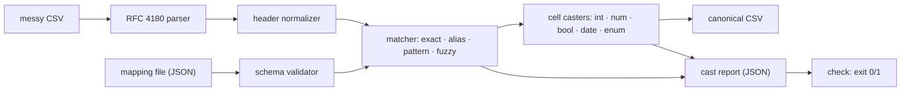

# colcast

[English](README.md) | [中文](README.zh.md) | [日本語](README.ja.md)

[](LICENSE)   [](CONTRIBUTING.md)

**colcast maps messy CSV headers onto a canonical schema — declarative rules with fuzzy fallback, typed cell casting, and an auditable report. A zero-dependency CLI and library, not a hosted import SaaS.**


```bash
# not yet on npm — install from a checkout of this repository
npm install && npm run build && npm pack
npm install -g ./colcast-0.1.0.tgz
```

## Why colcast?

Every B2B product ingests customer CSVs, and every customer names their columns differently: `E-Mail Address`, `SURNAME`, `Licence Count`, `"MRR, USD"`. Teams rebuild the same mapping layer forever — it is literally why import SaaS companies exist — or they buy a hosted importer and ship their customers' data to a third party. colcast is that layer as a small local tool: you declare the canonical schema once in a JSON mapping file (names, aliases, regex patterns, types, required flags), and a four-stage matcher resolves each incoming header — exact, alias, pattern, then a fuzzy fallback that survives typos, re-ordered words and `Qty`-style abbreviations. Every cell is then cast to its declared type with locale-aware tolerance (`€1.234,50`, `(150)`, `Nov 3 2024`, `yes`), and everything the tool decided — which stage matched, at what score, which near-misses lost and why, which cells failed with what reason on which row — lands in a JSON cast report you can gate CI on. Deterministic, offline, zero runtime dependencies.

|  | colcast | Flatfile | OneSchema | csv-parse |
|---|---|---|---|---|
| Runs | your machine / your CI | hosted SaaS | hosted SaaS | your machine |
| Customer data leaves your infra | never | yes | yes | never |
| Header mapping | rules + fuzzy fallback, 4 explicit stages | ML-assisted, in-app | ML-assisted, in-app | none (parser only) |
| Mapping decisions auditable | full report: stage, score, rejected candidates | partial | partial | n/a |
| Typed casting with per-row failure report | yes | yes | yes | cast callbacks, no report |
| Declarative config in version control | one JSON file | dashboard + SDK | dashboard + SDK | code |
| Price / dependencies | free, 0 runtime deps | commercial | commercial | free, 0 deps |

<sub>Capability claims checked against each product's public documentation, 2026-07.</sub>

## Features

- **Declarative mapping files** — canonical fields with types, aliases, case-insensitive regex patterns, required flags and enum value synonyms, all in one JSON file that lives in version control and is validated up front with exact error locations.
- **Four-stage matching, rules before guesses** — exact, alias and pattern stages are literal and fully predictable; only then does the fuzzy stage (Jaro-Winkler + token-set ratio, with `qty`/`dob`-style abbreviation expansion) fill the gaps, gated by a configurable threshold.
- **Every decision is auditable** — the report records the stage and score per column, every near-miss with the reason it lost (`below-threshold`, `field-taken`), unmapped headers and missing required fields; tune your aliases from the report alone.
- **Casting that refuses to guess** — `$4,860.00`, `€1.234,50`, `(150)`, `03/11/2024` with `dayFirst`, `Nov 3 2024`, `yes`/`n`/`on`, enum synonyms — all cast to one canonical form; genuinely ambiguous spellings (`1,23,4`) fail loudly with the raw text and row number in the report.
- **A CI gate for customer files** — `colcast check` exits 1 when a required field is unmapped or any cell fails to cast, so a bad import is caught before it hits your database.
- **Schema drafting** — `colcast init` infers a starter mapping file from a CSV's own headers and data, committing to a type only when every sampled cell agrees.
- **Zero dependencies, fully offline** — a dependency-free RFC 4180 parser included; Node.js is the only requirement and `typescript` the sole devDependency; nothing is ever sent anywhere.

## Quickstart

Install:

```bash
# not yet on npm — install from a checkout of this repository
npm install && npm run build && npm pack
npm install -g ./colcast-0.1.0.tgz
```

See how the bundled messy export maps onto the bundled schema:

```bash
colcast map examples/messy.csv --schema examples/contacts.schema.json
```

Output (real captured run):

```text
#  header                  ->  field       via      score
-  ----------------------  --  ----------  -------  -----
0  E-Mail Address          ->  email       pattern  1.00
1  firstName               ->  first_name  exact    1.00
2  SURNAME                 ->  last_name   alias    1.00
3  Company / Organization  ->  company     fuzzy    0.87
4  Licence Count           ->  seats       fuzzy    0.94
5  MRR, USD                ->  mrr         fuzzy    0.87
6  Sign-up Date            ->  signed_up   fuzzy    0.96
7  Is Active?              ->  active      alias    1.00
8  Plan Tier               ->  plan        fuzzy    0.89

unmapped columns (1): "Internal Notes"
```

Cast it — canonical CSV on stdout, audit report on the side — or gate CI with `check`:

```bash
colcast cast examples/messy.csv --schema examples/contacts.schema.json --report report.json > clean.csv
colcast check examples/messy.csv --schema examples/contacts.schema.json
```

```text
columns: 9/10 mapped (1 unmapped)
rows: 4
cast failures: 2
  seats (integer): 1 failed
    row 4: not an integer: "not sure"
  signed_up (date): 1 failed
    row 4: not a calendar date: "2024-13-45"
result: FAIL
```

`check` exits 1, the row lands in `report.json` with its raw text and reason, and the import stops before the bad data does any damage. The same pipeline is a library:

```js
import { readFileSync } from "node:fs";
import { parseCsv, parseSchema, castRows } from "colcast";

const schema = parseSchema(readFileSync("contacts.schema.json", "utf8"));
const { rows, report } = castRows(parseCsv(csvText).rows, schema);
report.summary.ok; // false — and report.fields says exactly which cells and why
```

## Commands and exit codes

| Command | Does | Key flags |
|---|---|---|
| `colcast map` | show the mapping plan (stage + score per column) | `--json`, `--threshold` |
| `colcast cast` | write canonical CSV + audit report | `--out`, `--report`, `--passthrough`, `--keep-raw`, `--strict` |
| `colcast check` | CI gate: fail on missing required fields or bad cells | `--json` |
| `colcast init` | draft a mapping file from a CSV's headers and data | `--out` |

Input `-` reads stdin; `--delimiter` handles `;` and `\t` exports. Exit codes: 0 success, 1 check failed, 2 usage error. `cast` keeps stdout pure CSV — the summary goes to stderr.

## Schema options

| Key | Default | Effect |
|---|---|---|
| `fuzzyThreshold` | `0.8` | minimum fuzzy score (0..1) to accept a match; override per run with `--threshold` |
| `dayFirst` | `false` | read ambiguous `03/11/2024` as 3 November instead of March 11 |
| `trim` | `true` | trim surrounding whitespace from every cell before casting |
| `nullValues` | `"", "null", "n/a", …` | cell spellings treated as empty rather than cast failures |

Field types are `string`, `integer`, `number`, `boolean`, `date` and `enum`. The full mapping-file format, the normalization rules and the assignment algorithm are specified in [docs/mapping-spec.md](docs/mapping-spec.md).

## Architecture



## Roadmap

- [x] Declarative mapping files, four-stage matcher with fuzzy fallback and audit trail, locale-tolerant typed casting, cast reports, `map`/`cast`/`check`/`init` CLI, RFC 4180 parser — 90 tests + `scripts/smoke.sh` (v0.1.0)
- [ ] Column-content validators (regex/range per field) reported alongside cast failures
- [ ] Multi-schema routing: pick the best-matching schema for a file automatically
- [ ] Streaming mode for multi-gigabyte files (constant memory)
- [ ] Learned alias suggestions: propose schema edits from accumulated cast reports

See the [open issues](https://github.com/JaydenCJ/colcast/issues) for the full list.

## Contributing

Contributions are welcome. Build with `npm install && npm run build`, then run `npm test` (90 tests) and `bash scripts/smoke.sh` (must print `SMOKE OK`) — this repository ships no CI, every claim above is verified by local runs. See [CONTRIBUTING.md](CONTRIBUTING.md), grab a [good first issue](https://github.com/JaydenCJ/colcast/issues?q=is%3Aissue+is%3Aopen+label%3A%22good+first+issue%22), or start a [discussion](https://github.com/JaydenCJ/colcast/discussions).

## License

[MIT](LICENSE)
