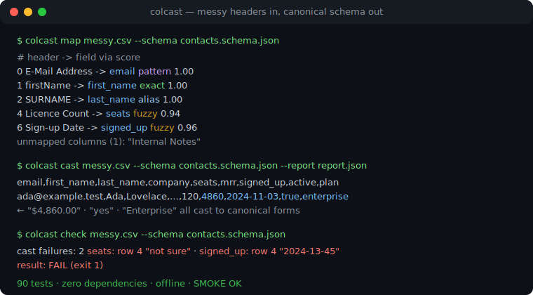
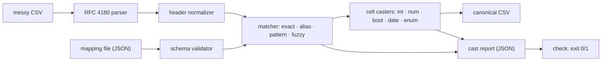

# colcast

[English](README.md) | [中文](README.zh.md) | [日本語](README.ja.md)

[](LICENSE)   [](CONTRIBUTING.md)

**colcast 把杂乱的 CSV 表头映射到规范 schema —— 声明式规则加模糊回退、按类型转换每个单元格、输出可审计的报告。它是零依赖的 CLI 和库，不是托管导入 SaaS。**



```bash
# not yet on npm — install from a checkout of this repository
npm install && npm run build && npm pack
npm install -g ./colcast-0.1.0.tgz
```

## 为什么选 colcast？

每个 B2B 产品都要摄取客户的 CSV，而每个客户的列名都不一样：`E-Mail Address`、`SURNAME`、`Licence Count`、`"MRR, USD"`。团队永远在重造同一套映射层——导入 SaaS 公司之所以存在正是因为这个——要么就买托管导入器，把客户数据交给第三方。colcast 把这一层做成一个小巧的本地工具：你在一个 JSON 映射文件里声明一次规范 schema（名称、别名、正则模式、类型、必填标记），四阶段匹配器逐个解析进来的表头——精确、别名、模式，最后是能扛住拼写错误、词序颠倒和 `Qty` 式缩写的模糊回退。随后每个单元格都按声明的类型转换，并对地区习惯宽容（`€1.234,50`、`(150)`、`Nov 3 2024`、`yes`），而工具做过的每个决定——哪个阶段命中、得分多少、哪些差点匹配上又为何落选、哪些单元格在哪一行因何失败——全部落进一份可用来卡 CI 的 JSON 转换报告。确定性、离线、零运行时依赖。

|  | colcast | Flatfile | OneSchema | csv-parse |
|---|---|---|---|---|
| 运行位置 | 你的机器 / 你的 CI | 托管 SaaS | 托管 SaaS | 你的机器 |
| 客户数据离开你的基础设施 | 从不 | 会 | 会 | 从不 |
| 表头映射 | 规则 + 模糊回退，4 个显式阶段 | ML 辅助，应用内 | ML 辅助，应用内 | 无（仅解析器） |
| 映射决定可审计 | 完整报告：阶段、得分、落选候选 | 部分 | 部分 | 不适用 |
| 类型转换并逐行报告失败 | 有 | 有 | 有 | cast 回调，无报告 |
| 声明式配置进版本控制 | 一个 JSON 文件 | 控制台 + SDK | 控制台 + SDK | 代码 |
| 价格 / 依赖 | 免费，0 运行时依赖 | 商业 | 商业 | 免费，0 依赖 |

<sub>能力对比核对自各产品的公开文档，2026-07。</sub>

## 功能

- **声明式映射文件** —— 规范字段带类型、别名、大小写不敏感的正则模式、必填标记和枚举值同义词，全部放在一个可进版本控制的 JSON 文件里，加载时即校验并给出精确的错误位置。
- **四阶段匹配，规则先于猜测** —— 精确、别名、模式三个阶段完全字面、完全可预测；之后模糊阶段（Jaro-Winkler + token-set ratio，带 `qty`/`dob` 式缩写展开）才来补缺口，由可配置阈值把关。
- **每个决定都可审计** —— 报告记录每列命中的阶段和得分、每个落选者及其原因（`below-threshold`、`field-taken`）、未映射的表头和缺失的必填字段；只看报告就能调好别名。
- **拒绝瞎猜的类型转换** —— `$4,860.00`、`€1.234,50`、`(150)`、配 `dayFirst` 的 `03/11/2024`、`Nov 3 2024`、`yes`/`n`/`on`、枚举同义词——全部转成统一的规范形式；真正歧义的写法（`1,23,4`）会大声失败，原文和行号进报告。
- **给客户文件设 CI 关卡** —— 必填字段没映射上或任何单元格转换失败时 `colcast check` 以 1 退出，坏导入在进数据库之前就被拦下。
- **schema 起草** —— `colcast init` 从 CSV 自己的表头和数据推断出一份入门映射文件，只有采样的每个单元格都一致时才敢定类型。
- **零依赖、完全离线** —— 内置无依赖的 RFC 4180 解析器；只需要 Node.js，devDependency 仅 `typescript`；任何数据都不会被发往任何地方。

## 快速上手

安装：

```bash
# not yet on npm — install from a checkout of this repository
npm install && npm run build && npm pack
npm install -g ./colcast-0.1.0.tgz
```

看看自带的杂乱导出如何映射到自带的 schema：

```bash
colcast map examples/messy.csv --schema examples/contacts.schema.json
```

输出（真实运行捕获）：

```text
#  header                  ->  field       via      score
-  ----------------------  --  ----------  -------  -----
0  E-Mail Address          ->  email       pattern  1.00
1  firstName               ->  first_name  exact    1.00
2  SURNAME                 ->  last_name   alias    1.00
3  Company / Organization  ->  company     fuzzy    0.87
4  Licence Count           ->  seats       fuzzy    0.94
5  MRR, USD                ->  mrr         fuzzy    0.87
6  Sign-up Date            ->  signed_up   fuzzy    0.96
7  Is Active?              ->  active      alias    1.00
8  Plan Tier               ->  plan        fuzzy    0.89

unmapped columns (1): "Internal Notes"
```

转换它——规范 CSV 走 stdout，审计报告另存——或用 `check` 卡 CI：

```bash
colcast cast examples/messy.csv --schema examples/contacts.schema.json --report report.json > clean.csv
colcast check examples/messy.csv --schema examples/contacts.schema.json
```

```text
columns: 9/10 mapped (1 unmapped)
rows: 4
cast failures: 2
  seats (integer): 1 failed
    row 4: not an integer: "not sure"
  signed_up (date): 1 failed
    row 4: not a calendar date: "2024-13-45"
result: FAIL
```

`check` 以 1 退出，该行连同原文和原因落进 `report.json`，坏数据还没造成损害导入就停了。同一条流水线也是库：

```js
import { readFileSync } from "node:fs";
import { parseCsv, parseSchema, castRows } from "colcast";

const schema = parseSchema(readFileSync("contacts.schema.json", "utf8"));
const { rows, report } = castRows(parseCsv(csvText).rows, schema);
report.summary.ok; // false — and report.fields says exactly which cells and why
```

## 命令与退出码

| 命令 | 作用 | 主要参数 |
|---|---|---|
| `colcast map` | 展示映射方案（每列的阶段 + 得分） | `--json`、`--threshold` |
| `colcast cast` | 写出规范 CSV + 审计报告 | `--out`、`--report`、`--passthrough`、`--keep-raw`、`--strict` |
| `colcast check` | CI 关卡：必填缺失或坏单元格即失败 | `--json` |
| `colcast init` | 从 CSV 的表头和数据起草映射文件 | `--out` |

输入 `-` 读 stdin；`--delimiter` 支持 `;` 和 `\t` 导出。退出码：0 成功，1 检查失败，2 用法错误。`cast` 的 stdout 保持纯 CSV——摘要走 stderr。

## Schema 选项

| 键 | 默认值 | 效果 |
|---|---|---|
| `fuzzyThreshold` | `0.8` | 接受模糊匹配的最低得分（0..1）；单次运行可用 `--threshold` 覆盖 |
| `dayFirst` | `false` | 把有歧义的 `03/11/2024` 读作 11 月 3 日而不是 3 月 11 日 |
| `trim` | `true` | 转换前去掉每个单元格的首尾空白 |
| `nullValues` | `"", "null", "n/a", …` | 视为空值而非转换失败的单元格写法 |

字段类型有 `string`、`integer`、`number`、`boolean`、`date` 和 `enum`。映射文件的完整格式、归一化规则和分配算法见 [docs/mapping-spec.md](docs/mapping-spec.md)。

## 架构



## 路线图

- [x] 声明式映射文件、带模糊回退和审计痕迹的四阶段匹配器、宽容地区习惯的类型转换、转换报告、`map`/`cast`/`check`/`init` CLI、RFC 4180 解析器 —— 90 个测试 + `scripts/smoke.sh`（v0.1.0）
- [ ] 列内容校验器（按字段的正则/范围），与转换失败一起报告
- [ ] 多 schema 路由：自动为文件挑选最匹配的 schema
- [ ] 流式模式，处理数 GB 大文件（常量内存）
- [ ] 别名学习建议：从累积的转换报告中提出 schema 修改

完整列表见 [open issues](https://github.com/JaydenCJ/colcast/issues)。

## 贡献

欢迎贡献。先 `npm install && npm run build` 构建，然后跑 `npm test`（90 个测试）和 `bash scripts/smoke.sh`（必须打印 `SMOKE OK`）——本仓库不带 CI，以上所有断言都由本地运行验证。参见 [CONTRIBUTING.md](CONTRIBUTING.md)，认领一个 [good first issue](https://github.com/JaydenCJ/colcast/issues?q=is%3Aissue+is%3Aopen+label%3A%22good+first+issue%22)，或发起 [discussion](https://github.com/JaydenCJ/colcast/discussions)。

## 许可证

[MIT](LICENSE)
